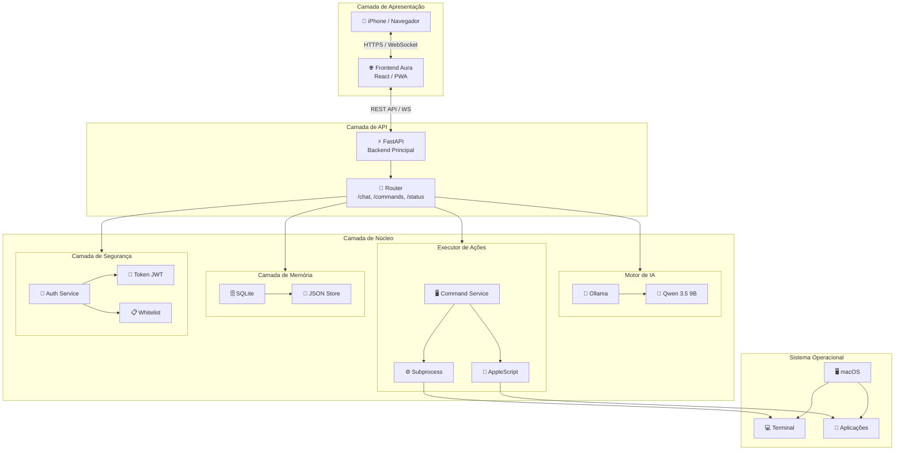
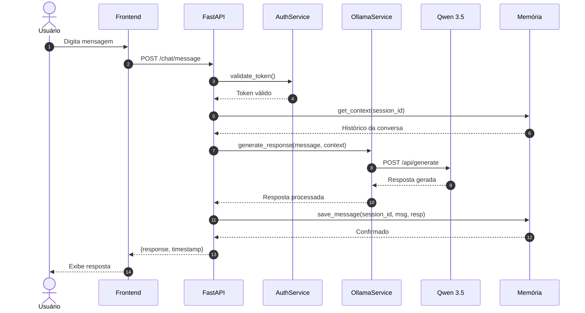
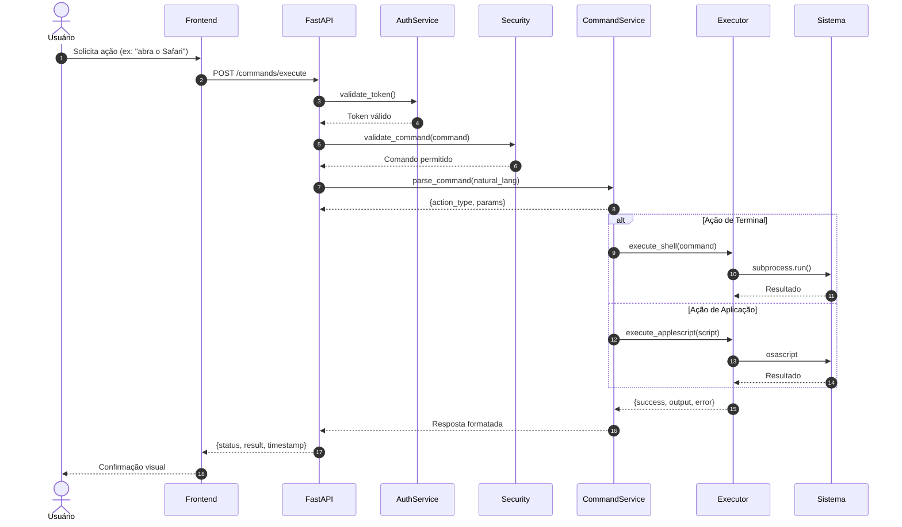

# Blueprint Oficial - Aura v1

## Assistente Operacional Pessoal

---

**Versão:** 1.0  
**Data:** Março 2025  
**Status:** Documento Técnico Oficial

---

## Sumário

1. [Visão Geral](#1-visão-geral)
2. [Objetivos e Requisitos](#2-objetivos-e-requisitos)
3. [Arquitetura e Módulos](#3-arquitetura-e-módulos)
4. [Especificação da API](#4-especificação-da-api)
5. [Roadmap de Implementação](#5-roadmap-de-implementação)
6. [Considerações Finais](#6-considerações-finais)

---

## 1. Visão Geral

### 1.1 Definição Oficial da Aura v1

A **Aura v1** é uma **assistente operacional pessoal**, com interface web acessível pelo iPhone, conectada a um backend em FastAPI no Mac, usando Qwen via Ollama para linguagem natural e um executor seguro de comandos para agir no computador.

### 1.2 Missão

> Permitir que você converse com a assistente pelo iPhone e faça seu Mac executar tarefas operacionais de forma controlada.

### 1.3 Escopo da v1

| Área | Funcionalidades Incluídas |
|------|---------------------------|
| **Entrada** | Chat pelo navegador do iPhone e Mac |
| **Inteligência** | Interpretação via LLM local, respostas em português |
| **Ações** | Abrir VS Code, abrir projetos, comandos pré-aprovados, listar projetos, status básico |
| **Segurança** | Autenticação simples, whitelist de comandos, bloqueio de comandos perigosos, logs |

### 1.4 Fora do Escopo v1

- Voz e reconhecimento de fala
- WhatsApp e integrações com mensageiras
- Automação de casa (IoT)
- App iOS nativo
- Memória vetorial avançada / RAG
- Múltiplos agentes complexos
- Reconhecimento facial

### 1.5 Stack Oficial

| Camada | Tecnologia |
|--------|------------|
| **Backend** | FastAPI (Python 3.11+) |
| **LLM** | Ollama + Qwen 3.5 9B |
| **Frontend** | HTML simples → Next.js (futuro) |
| **Armazenamento** | SQLite / JSON |
| **Automação** | Python subprocess + AppleScript |
| **Segurança** | JWT Token + Whitelist |
| **Deploy Frontend** | Vercel |

---

## 2. Objetivos e Requisitos

### 2.1 Objetivos do Sistema

| ID | Objetivo | Métrica de Sucesso |
|:---|:---------|:-------------------|
| OBJ-001 | Permitir comunicação conversacional entre usuário (iPhone) e assistente (Mac) via navegador | 100% das mensagens enviadas pelo iPhone devem ser recebidas e processadas pelo Mac em menos de 3 segundos |
| OBJ-002 | Interpretar intenções do usuário via LLM local e traduzir em ações executáveis | Taxa de acerto na interpretação de comandos ≥ 85% em cenários de teste pré-definidos |
| OBJ-003 | Executar comandos operacionais no Mac de forma controlada e auditável | 100% dos comandos executados devem ser registrados em logs com timestamp e contexto |
| OBJ-004 | Garantir segurança na execução de comandos através de lista de permissões e bloqueios | Zero execução de comandos não autorizados ou classificados como perigosos |
| OBJ-005 | Fornecer respostas em português natural com contexto das ações executadas | Tempo médio de resposta do sistema ≤ 5 segundos para comandos simples |

### 2.2 Requisitos Funcionais

#### 2.2.1 Chat/Conversa

| ID | Descrição | Prioridade |
|:---|:----------|:-----------|
| RF-001 | O sistema deve permitir que o usuário envie mensagens de texto via navegador do iPhone | Alta |
| RF-002 | O sistema deve permitir que o usuário envie mensagens de texto via navegador do Mac | Alta |
| RF-003 | O sistema deve processar mensagens do usuário através de LLM local (Ollama + Qwen) | Alta |
| RF-004 | O sistema deve interpretar a intenção do usuário e classificar o tipo de ação solicitada | Alta |
| RF-005 | O sistema deve responder ao usuário em português, confirmando ações executadas ou solicitando esclarecimentos | Alta |
| RF-006 | O sistema deve manter histórico de conversas da sessão atual (memória curta) | Média |
| RF-007 | O sistema deve exibir indicador visual de "pensando" durante processamento do LLM | Média |

#### 2.2.2 Execução de Comandos

| ID | Descrição | Prioridade |
|:---|:----------|:-----------|
| RF-008 | O sistema deve validar comandos solicitados contra lista de comandos pré-aprovados | Alta |
| RF-009 | O sistema deve bloquear automaticamente comandos classificados como perigosos (rm -rf, format, etc.) | Alta |
| RF-010 | O sistema deve executar comandos aprovados via subprocess Python no Mac | Alta |
| RF-011 | O sistema deve capturar e retornar output (stdout/stderr) dos comandos executados | Alta |
| RF-012 | O sistema deve permitir execução de comandos com timeout configurável (padrão: 30s) | Média |
| RF-013 | O sistema deve suportar execução de comandos em diretórios de trabalho específicos | Média |
| RF-014 | O sistema deve permitir ao administrador adicionar/remover comandos da lista de permissões | Média |

#### 2.2.3 Gerenciamento de Projetos

| ID | Descrição | Prioridade |
|:---|:----------|:-----------|
| RF-015 | O sistema deve permitir abrir o VS Code com comando "abrir VS Code" ou similar | Alta |
| RF-016 | O sistema deve permitir abrir pasta/projeto específico no VS Code | Alta |
| RF-017 | O sistema deve listar projetos disponíveis no diretório de trabalho configurado | Média |
| RF-018 | O sistema deve permitir navegação entre pastas do sistema de arquivos | Média |
| RF-019 | O sistema deve permitir checar status de repositórios Git (branch, status, último commit) | Média |
| RF-020 | O sistema deve permitir abrir projetos por nome ou palavra-chave | Baixa |

#### 2.2.4 Segurança e Autenticação

| ID | Descrição | Prioridade |
|:---|:----------|:-----------|
| RF-021 | O sistema deve exigir autenticação simples (token ou senha) para acesso ao chat | Alta |
| RF-022 | O sistema deve registrar todos os comandos executados em arquivo de log | Alta |
| RF-023 | O sistema deve registrar timestamp, usuário, comando e resultado de cada ação | Alta |
| RF-024 | O sistema deve requerer confirmação explícita para comandos destrutivos (quando implementados em versões futuras) | Média |
| RF-025 | O sistema deve limitar taxa de requisições (rate limiting) para prevenir abuso | Média |
| RF-026 | O sistema deve permitir visualização de logs de auditoria pelo administrador | Baixa |

### 2.3 Requisitos Não-Funcionais

#### 2.3.1 Performance

| ID | Descrição | Critério Mensurável |
|:---|:----------|:--------------------|
| RNF-001 | Tempo de resposta do LLM para interpretação | ≤ 3 segundos para prompts de até 100 tokens |
| RNF-002 | Tempo total de processamento (recepção à resposta) | ≤ 5 segundos para comandos simples |
| RNF-003 | Tempo de execução de comandos no Mac | ≤ 10 segundos para comandos não interativos |
| RNF-004 | Capacidade de conexões simultâneas | Suportar até 5 conexões WebSocket simultâneas |
| RNF-005 | Uso de memória RAM pelo backend | ≤ 512 MB em operação normal |

#### 2.3.2 Segurança

| ID | Descrição | Critério Mensurável |
|:---|:----------|:--------------------|
| RNF-006 | Bloqueio de comandos perigosos | 100% dos comandos na blacklist devem ser bloqueados |
| RNF-007 | Validação de comandos permitidos | Apenas comandos na whitelist podem ser executados |
| RNF-008 | Proteção de credenciais | Tokens e senhas nunca devem ser expostos em logs ou respostas |
| RNF-009 | Isolamento de execução | Comandos devem executar com privilégios mínimos necessários |
| RNF-010 | Retenção de logs | Logs devem ser mantidos por no mínimo 30 dias |

#### 2.3.3 Usabilidade

| ID | Descrição | Critério Mensurável |
|:---|:----------|:--------------------|
| RNF-011 | Interface responsiva | Frontend deve funcionar em telas de 320px a 1920px |
| RNF-012 | Compatibilidade de navegadores | Suporte a Safari (iOS), Chrome e Firefox nas últimas 2 versões |
| RNF-013 | Linguagem das respostas | 100% das respostas do sistema em português do Brasil |
| RNF-014 | Clareza das mensagens de erro | Mensagens de erro devem ser compreensíveis para usuários não-técnicos |
| RNF-015 | Feedback visual de ações | Interface deve indicar status de processamento e conclusão |

#### 2.3.4 Confiabilidade

| ID | Descrição | Critério Mensurável |
|:---|:----------|:--------------------|
| RNF-016 | Disponibilidade do serviço | Backend deve estar disponível 99% do tempo quando Mac estiver ligado |
| RNF-017 | Recuperação de falhas | Sistema deve recuperar-se automaticamente de erros de subprocess |
| RNF-018 | Persistência de dados | Configurações e logs devem persistir entre reinicializações |
| RNF-019 | Graceful degradation | Se LLM falhar, sistema deve informar usuário e não travar |
| RNF-020 | Timeout de operações | Operações que excedam timeout devem ser canceladas e notificadas |

### 2.4 Restrições e Premissas

#### 2.4.1 Restrições Técnicas

- **RT-001**: O LLM deve rodar localmente via Ollama, sem dependência de APIs externas
- **RT-002**: O backend deve ser implementado em Python com FastAPI
- **RT-003**: O sistema operacional do servidor (Mac) deve ser macOS 12.0 ou superior
- **RT-004**: O frontend deve ser acessível via navegador, sem necessidade de app nativo
- **RT-005**: Armazenamento de dados deve utilizar SQLite ou arquivos JSON
- **RT-006**: A comunicação entre iPhone e Mac deve ocorrer via rede local (mesma WiFi) ou VPN

#### 2.4.2 Restrições de Escopo (v1)

- **RE-001**: Não haverá suporte a comandos de voz na v1
- **RE-002**: Não haverá integração com WhatsApp ou outras mensageiras
- **RE-003**: Não haverá automação de dispositivos domésticos (IoT)
- **RE-004**: Não haverá app nativo para iOS na v1 (apenas web)
- **RE-005**: Não haverá memória vetorial avançada ou RAG na v1
- **RE-006**: Não haverá persistência de histórico entre sessões na v1
- **RE-007**: Não haverá suporte a múltiplos usuários simultâneos na v1

#### 2.4.3 Premissas do Projeto

- **PR-001**: O Mac servidor estará ligado e conectado à rede durante o uso
- **PR-002**: O iPhone e o Mac estarão na mesma rede local ou conectados via VPN
- **PR-003**: O usuário possui permissões administrativas no Mac para instalação
- **PR-004**: Ollama estará previamente instalado e configurado no Mac
- **PR-005**: O modelo Qwen estará disponível e funcional no Ollama
- **PR-006**: O usuário possui conhecimento básico de comandos de terminal
- **PR-007**: O VS Code está instalado no Mac para funcionalidades relacionadas

### 2.5 Matriz de Rastreabilidade

| Objetivo | RFs Relacionados | RNFs Relacionados |
|:---------|:-----------------|:------------------|
| OBJ-001 | RF-001, RF-002, RF-005 | RNF-011, RNF-012 |
| OBJ-002 | RF-003, RF-004 | RNF-001, RNF-013 |
| OBJ-003 | RF-008, RF-009, RF-010, RF-011 | RNF-002, RNF-003, RNF-019 |
| OBJ-004 | RF-021, RF-022, RF-023 | RNF-006, RNF-007, RNF-008, RNF-009, RNF-010 |
| OBJ-005 | RF-005, RF-007 | RNF-001, RNF-013, RNF-014 |

---

## 3. Arquitetura e Módulos

### 3.1 Visão Geral da Arquitetura



### 3.2 Descrição das Camadas

| Camada | Responsabilidade | Tecnologia Principal |
|--------|------------------|---------------------|
| **Apresentação** | Interface do usuário, chat, histórico, botões rápidos | React, PWA, WebSocket |
| **API** | Roteamento, validação, orquestração de serviços | FastAPI, Pydantic, Uvicorn |
| **Motor de IA** | Processamento de linguagem natural, geração de respostas | Ollama, Qwen 3.5 9B |
| **Executor** | Execução de comandos no sistema operacional | Python subprocess, AppleScript |
| **Memória** | Persistência de conversas, projetos, configurações | SQLite, JSON |
| **Segurança** | Autenticação, autorização, validação de comandos | JWT, Whitelist |

### 3.3 Componentes do Sistema

| Componente | Tecnologia | Responsabilidade | Status |
|------------|------------|------------------|--------|
| **Frontend Aura** | React 18, TypeScript, Tailwind CSS | Interface web responsiva, chat em tempo real, histórico de conversas | Core |
| **Backend API** | FastAPI, Python 3.11, Uvicorn | Endpoints REST, WebSocket, validação de requests | Core |
| **Motor LLM** | Ollama 0.3+, Qwen 3.5 9B | Inferência local, processamento de linguagem natural | Core |
| **Serviço de Comandos** | Python, subprocess, os | Execução segura de comandos no terminal | Core |
| **Serviço de Projetos** | Python, pathlib, gitpython | Gerenciamento de projetos, navegação de diretórios | Core |
| **Serviço de Autenticação** | Python-Jose, bcrypt | Validação de tokens, controle de acesso | Core |
| **Camada de Memória** | SQLite3, JSON | Persistência de conversas, configurações, cache | Core |
| **Logger** | Python logging, structlog | Registro de eventos, auditoria de comandos | Support |
| **Config Manager** | Pydantic Settings, python-dotenv | Gerenciamento de variáveis de ambiente | Support |

### 3.4 Fluxos Principais

#### Fluxo de Conversa (Chat)



#### Fluxo de Comando Operacional



### 3.5 Estrutura de Pastas

```
aura/
├── 📁 backend/                          # Backend FastAPI
│   ├── 📁 app/                          # Código fonte principal
│   │   ├── 📄 __init__.py
│   │   ├── 📄 main.py                   # Entry point da aplicação
│   │   │
│   │   ├── 📁 api/                      # Camada de API
│   │   │   ├── 📄 __init__.py
│   │   │   ├── 📁 v1/                   # Versão 1 da API
│   │   │   │   ├── 📄 __init__.py
│   │   │   │   ├── 📁 endpoints/        # Endpoints agrupados
│   │   │   │   │   ├── 📄 __init__.py
│   │   │   │   │   ├── 📄 chat.py       # /chat/* endpoints
│   │   │   │   │   ├── 📄 commands.py   # /commands/* endpoints
│   │   │   │   │   ├── 📄 status.py     # /status/* endpoints
│   │   │   │   │   └── 📄 auth.py       # /auth/* endpoints
│   │   │   │   └── 📄 router.py         # Agregador de rotas v1
│   │   │   └── 📄 deps.py               # Dependências injetáveis
│   │   │
│   │   ├── 📁 core/                     # Camada de núcleo
│   │   │   ├── 📄 __init__.py
│   │   │   ├── 📄 config.py             # Configurações (Pydantic Settings)
│   │   │   ├── 📄 security.py           # JWT, hashing, validação
│   │   │   ├── 📄 logger.py             # Configuração de logging
│   │   │   └── 📄 exceptions.py         # Exceções customizadas
│   │   │
│   │   ├── 📁 models/                   # Modelos de dados (Pydantic)
│   │   │   ├── 📄 __init__.py
│   │   │   ├── 📄 chat_models.py        # Schemas de chat
│   │   │   ├── 📄 command_models.py     # Schemas de comandos
│   │   │   ├── 📄 auth_models.py        # Schemas de autenticação
│   │   │   └── 📄 common_models.py      # Schemas compartilhados
│   │   │
│   │   ├── 📁 services/                 # Camada de serviços
│   │   │   ├── 📄 __init__.py
│   │   │   ├── 📄 ollama_service.py     # Comunicação com Ollama
│   │   │   ├── 📄 command_service.py    # Execução de comandos
│   │   │   ├── 📄 project_service.py    # Gerenciamento de projetos
│   │   │   ├── 📄 auth_service.py       # Lógica de autenticação
│   │   │   └── 📄 memory_service.py     # Operações de memória
│   │   │
│   │   ├── 📁 db/                       # Camada de persistência
│   │   │   ├── 📄 __init__.py
│   │   │   ├── 📄 base.py               # Base declarativa SQLAlchemy
│   │   │   ├── 📄 session.py            # Gerenciamento de sessões
│   │   │   ├── 📁 migrations/           # Alembic migrations
│   │   │   └── 📁 repositories/         # Repositories pattern
│   │   │
│   │   └── 📁 utils/                    # Utilitários
│   │
│   ├── 📁 data/                         # Dados persistentes
│   │   ├── 📁 sqlite/                   # Bancos SQLite
│   │   ├── 📁 json/                     # Armazenamento JSON
│   │   └── 📁 logs/                     # Logs da aplicação
│   │
│   ├── 📁 tests/                        # Testes
│   ├── 📄 requirements.txt              # Dependências Python
│   └── 📄 .env.example                  # Template de variáveis de ambiente
│
├── 📁 frontend/                         # Frontend React
│   ├── 📁 public/                       # Assets públicos
│   └── 📁 src/                          # Código fonte
│
├── 📁 docs/                             # Documentação
└── 📄 README.md                         # Documentação principal
```

### 3.6 Interfaces entre Módulos

#### OllamaService Interface

```python
class OllamaService:
    """Interface para comunicação com Ollama LLM."""
    
    async def generate_response(
        self,
        message: str,
        context: List[Message],
        model: str = "qwen3.5:9b",
        temperature: float = 0.7
    ) -> LLMResponse:
        """Gera resposta do modelo LLM."""
        pass
    
    async def health_check(self) -> bool:
        """Verifica disponibilidade do Ollama."""
        pass
```

#### CommandService Interface

```python
class CommandService:
    """Interface para execução de comandos operacionais."""
    
    async def execute_command(
        self,
        command: str,
        command_type: CommandType,
        user_id: str,
        validate: bool = True
    ) -> CommandResult:
        """Executa comando no sistema."""
        pass
    
    def validate_command(
        self,
        command: str,
        whitelist: List[str]
    ) -> ValidationResult:
        """Valida se comando é permitido."""
        pass
```

### 3.7 Tecnologias por Camada

| Camada | Tecnologia | Versão | Propósito |
|--------|------------|--------|-----------|
| **Frontend** | React | 18.x | Framework UI |
| | TypeScript | 5.x | Tipagem estática |
| | Tailwind CSS | 3.x | Estilização |
| | Redux Toolkit | 2.x | Estado global |
| **Backend** | Python | 3.11+ | Linguagem principal |
| | FastAPI | 0.110+ | Framework web |
| | Uvicorn | 0.27+ | Servidor ASGI |
| | Pydantic | 2.x | Validação de dados |
| | SQLAlchemy | 2.x | ORM |
| **IA/LLM** | Ollama | 0.3+ | Runtime LLM |
| | Qwen | 3.5 9B | Modelo de linguagem |
| **Banco de Dados** | SQLite | 3.x | Persistência relacional |
| **Infraestrutura** | macOS | 14+ | Sistema operacional |

---

## 4. Especificação da API

### 4.1 Visão Geral

| Atributo | Valor |
|----------|-------|
| **Base URL** | `http://localhost:8000` (desenvolvimento) |
| **Versão** | v1 |
| **Formato** | JSON |
| **Content-Type** | `application/json` |
| **Autenticação** | Bearer Token |

### 4.2 Formato de Resposta Padrão

```json
{
  "success": true,
  "data": {},
  "error": null,
  "timestamp": "2024-01-15T10:30:00Z"
}
```

### 4.3 Endpoints

#### GET /status

| Atributo | Valor |
|----------|-------|
| **Método** | GET |
| **Path** | `/status` |
| **Descrição** | Retorna o status atual do servidor |
| **Autenticação** | Não |

**Response 200:**
```json
{
  "success": true,
  "data": {
    "status": "healthy",
    "version": "1.0.0",
    "uptime_seconds": 3600,
    "services": {
      "api": "online",
      "llm": "online",
      "filesystem": "online"
    }
  },
  "error": null,
  "timestamp": "2024-01-15T10:30:00Z"
}
```

---

#### POST /chat

| Atributo | Valor |
|----------|-------|
| **Método** | POST |
| **Path** | `/chat` |
| **Descrição** | Envia mensagem para a Aura e recebe resposta |
| **Autenticação** | Sim - Bearer Token |

**Request:**
```json
{
  "message": "Quais são os projetos ativos?",
  "context": {
    "session_id": "sess_abc123",
    "history": []
  },
  "options": {
    "stream": false,
    "temperature": 0.7
  }
}
```

**Response 200:**
```json
{
  "success": true,
  "data": {
    "response": "Você tem 3 projetos ativos: aura-backend, dashboard-app e api-docs.",
    "intent": "consulta",
    "action_taken": null,
    "session_id": "sess_abc123",
    "processing_time_ms": 890
  },
  "error": null,
  "timestamp": "2024-01-15T10:30:05Z"
}
```

**Response 200 (com ação):**
```json
{
  "success": true,
  "data": {
    "response": "Abrindo o projeto aura-backend no VS Code...",
    "intent": "acao",
    "action_taken": {
      "command": "open_project",
      "params": { "project_name": "aura-backend" },
      "status": "executed",
      "result": { "success": true, "message": "Projeto aberto com sucesso" }
    },
    "session_id": "sess_abc123",
    "processing_time_ms": 1250
  },
  "error": null,
  "timestamp": "2024-01-15T10:30:05Z"
}
```

---

#### POST /command

| Atributo | Valor |
|----------|-------|
| **Método** | POST |
| **Path** | `/command` |
| **Descrição** | Executa uma ação direta no sistema (whitelist) |
| **Autenticação** | Sim - Bearer Token |

**Request:**
```json
{
  "command": "open_project",
  "params": {
    "project_name": "aura-backend"
  },
  "options": {
    "confirm": false,
    "async": false
  }
}
```

**Response 200:**
```json
{
  "success": true,
  "data": {
    "command": "open_project",
    "status": "success",
    "result": {
      "project": "aura-backend",
      "path": "/home/user/projects/aura-backend",
      "opened_in": "vscode",
      "timestamp": "2024-01-15T10:30:10Z"
    },
    "execution_time_ms": 450,
    "log_id": "log_789xyz"
  },
  "error": null,
  "timestamp": "2024-01-15T10:30:10Z"
}
```

**Response 400 (comando não permitido):**
```json
{
  "success": false,
  "data": null,
  "error": {
    "code": "COMMAND_NOT_ALLOWED",
    "message": "Comando 'delete_file' não está na whitelist",
    "allowed_commands": [
      "open_vscode",
      "open_project",
      "list_projects",
      "run_project_dev",
      "git_status",
      "vercel_deploy",
      "show_logs"
    ]
  },
  "timestamp": "2024-01-15T10:30:10Z"
}
```

---

#### GET /projects

| Atributo | Valor |
|----------|-------|
| **Método** | GET |
| **Path** | `/projects` |
| **Descrição** | Retorna lista de projetos disponíveis |
| **Autenticação** | Sim - Bearer Token |

**Query Parameters:**

| Parâmetro | Tipo | Obrigatório | Descrição |
|-----------|------|-------------|-----------|
| `status` | string | Não | Filtrar: `active`, `archived`, `all` |
| `sort_by` | string | Não | Ordenar: `name`, `modified`, `created` |
| `limit` | integer | Não | Limite (padrão: 50, max: 100) |

**Response 200:**
```json
{
  "success": true,
  "data": {
    "projects": [
      {
        "id": "proj_001",
        "name": "aura-backend",
        "path": "/home/user/projects/aura-backend",
        "type": "python",
        "framework": "fastapi",
        "status": "active",
        "last_modified": "2024-01-15T09:00:00Z",
        "git": {
          "has_repo": true,
          "branch": "main",
          "uncommitted_changes": 3
        }
      }
    ],
    "total": 3,
    "workspace_path": "/home/user/projects"
  },
  "error": null,
  "timestamp": "2024-01-15T10:30:15Z"
}
```

---

#### POST /projects/open

| Atributo | Valor |
|----------|-------|
| **Método** | POST |
| **Path** | `/projects/open` |
| **Descrição** | Abre um projeto específico no VS Code |
| **Autenticação** | Sim - Bearer Token |

**Request:**
```json
{
  "project_name": "aura-backend",
  "options": {
    "new_window": false,
    "goto_file": null
  }
}
```

**Response 200:**
```json
{
  "success": true,
  "data": {
    "project": {
      "id": "proj_001",
      "name": "aura-backend",
      "path": "/home/user/projects/aura-backend"
    },
    "opened": true,
    "editor": "vscode",
    "window": "same",
    "timestamp": "2024-01-15T10:30:20Z"
  },
  "error": null,
  "timestamp": "2024-01-15T10:30:20Z"
}
```

### 4.4 Whitelist de Comandos

| Comando | Descrição | Parâmetros |
|---------|-----------|------------|
| `open_vscode` | Abre o VS Code | `path` (opcional) |
| `open_project` | Abre projeto específico | `project_name` (obrigatório) |
| `list_projects` | Lista projetos do workspace | - |
| `run_project_dev` | Inicia servidor de desenvolvimento | `project_name` (obrigatório) |
| `git_status` | Mostra status do Git | `project_name` (opcional) |
| `vercel_deploy` | Faz deploy na Vercel | `project_name` (obrigatório) |
| `show_logs` | Exibe logs do projeto | `project_name`, `lines` (opcional) |

### 4.5 Códigos de Erro

| Código | Descrição | HTTP Status |
|--------|-----------|-------------|
| `INVALID_REQUEST` | Requisição mal formatada | 400 |
| `MISSING_PARAMETER` | Parâmetro obrigatório ausente | 422 |
| `COMMAND_NOT_ALLOWED` | Comando não está na whitelist | 403 |
| `PROJECT_NOT_FOUND` | Projeto não encontrado | 404 |
| `AUTHENTICATION_REQUIRED` | Token de autenticação ausente | 401 |
| `INVALID_TOKEN` | Token inválido ou expirado | 401 |
| `RATE_LIMIT_EXCEEDED` | Limite de requisições excedido | 429 |
| `LLM_SERVICE_ERROR` | Erro no serviço LLM | 500 |
| `COMMAND_EXECUTION_ERROR` | Erro na execução do comando | 500 |
| `INTERNAL_ERROR` | Erro interno do servidor | 500 |

### 4.6 Exemplos de Uso (cURL)

```bash
# Verificar Status
curl -X GET http://localhost:8000/status

# Enviar Mensagem de Chat
curl -X POST http://localhost:8000/chat \
  -H "Authorization: Bearer seu_token_aqui" \
  -H "Content-Type: application/json" \
  -d '{"message": "Liste meus projetos"}'

# Executar Comando
curl -X POST http://localhost:8000/command \
  -H "Authorization: Bearer seu_token_aqui" \
  -H "Content-Type: application/json" \
  -d '{"command": "git_status", "params": {"project_name": "aura-backend"}}'

# Listar Projetos
curl -X GET "http://localhost:8000/projects?status=active" \
  -H "Authorization: Bearer seu_token_aqui"

# Abrir Projeto
curl -X POST http://localhost:8000/projects/open \
  -H "Authorization: Bearer seu_token_aqui" \
  -H "Content-Type: application/json" \
  -d '{"project_name": "aura-backend"}'
```

---

## 5. Roadmap de Implementação

### 5.1 Visão Geral

```
┌─────────────────────────────────────────────────────────────────────────────┐
│                         ROADMAP AURA v1 - 16 SEMANAS                        │
├─────────────┬─────────────┬─────────────┬─────────────┬─────────────────────┤
│   SPRINT 1  │   SPRINT 2  │   SPRINT 3  │   SPRINT 4  │      FUTURO         │
│  Backend    │   Web UI    │  Executor   │   Remoto    │    (v2+)            │
│  Core       │   Mobile    │  Projetos   │   Público   │                     │
├─────────────┼─────────────┼─────────────┼─────────────┼─────────────────────┤
│ Semanas 1-4 │ Semanas 5-8 │ Semanas 9-12│ Semanas13-16│    Pós v1           │
└─────────────┴─────────────┴─────────────┴─────────────┴─────────────────────┘
```

| Métrica | Valor |
|---------|-------|
| **Duração Total** | 16 semanas (4 meses) |
| **Horas Estimadas** | 320-400h |
| **MVP Funcional** | Semana 8 |
| **v1.0 Completa** | Semana 16 |

### 5.2 Sprints Detalhados

#### Sprint 1: Fundação Backend (Semanas 1-4)

| Atributo | Valor |
|----------|-------|
| **Objetivo** | Estabilizar arquitetura backend, estruturar APIs e estabelecer base de dados |
| **Stack** | FastAPI, SQLite, Ollama |

**Entregáveis:**
- [ ] Estruturação de Rotas: Separar endpoints em módulos
- [ ] Endpoint `/command`: Implementar processamento de comandos pré-aprovados
- [ ] Cadastro de Projetos: CRUD completo de projetos
- [ ] Integração Ollama: Cliente robusto para comunicação com Qwen
- [ ] Modelo de Dados: Esquema SQLite para projetos, comandos e logs
- [ ] Logging Estruturado: Sistema de logs com níveis e rotação
- [ ] Testes Unitários: Cobertura mínima de 70%

**Critérios de Aceitação:**
1. Todas as rotas respondem com status HTTP adequados
2. Endpoint `/command` processa comandos com validação de segurança
3. CRUD de projetos funcional
4. Integração com Ollama responde em < 3s
5. Documentação OpenAPI disponível em `/docs`

---

#### Sprint 2: Interface Web e Acesso Mobile (Semanas 5-8)

| Atributo | Valor |
|----------|-------|
| **Objetivo** | Criar interface web funcional, habilitar acesso mobile e implementar autenticação |
| **Stack** | Next.js, Tailwind CSS, JWT |

**Entregáveis:**
- [ ] Interface de Chat: Componente de chat com histórico visual
- [ ] Design Responsivo: Layout adaptável para desktop e mobile
- [ ] PWA Básico: Manifest e service worker para instalação no iPhone
- [ ] Autenticação Simples: Login com JWT, proteção de rotas
- [ ] Histórico de Conversas: Persistência e visualização
- [ ] Dashboard de Projetos: Listagem visual de projetos
- [ ] Feedback Visual: Loading states, toasts de notificação

**Critérios de Aceitação:**
1. Interface funciona no Safari do iPhone
2. Usuário consegue "Adicionar à Tela de Início"
3. Login funciona com JWT
4. Layout não quebra em telas de 320px a 1920px

---

#### Sprint 3: Executor de Projetos (Semanas 9-12)

| Atributo | Valor |
|----------|-------|
| **Objetivo** | Implementar automação completa de projetos |
| **Stack** | Python subprocess, VS Code CLI, WebSocket |

**Entregáveis:**
- [ ] Abertura de VS Code: Comando para abrir workspace
- [ ] Abertura de Pastas: Navegação de diretórios
- [ ] Execução de Comandos: Rodar scripts pré-aprovados
- [ ] Terminal Web: Visualização de saída em tempo real
- [ ] Whitelist de Comandos: Configuração de comandos seguros
- [ ] Monitoramento de Processos: Tracking e cleanup

**Critérios de Aceitação:**
1. Comando "abrir projeto X" abre VS Code em < 5s
2. Comandos da whitelist executam sem confirmação
3. Saída de comandos é exibida em tempo real
4. Processos podem ser terminados via UI

---

#### Sprint 4: Acesso Remoto e Deploy Público (Semanas 13-16)

| Atributo | Valor |
|----------|-------|
| **Objetivo** | Publicar frontend, habilitar acesso seguro fora da rede local |
| **Stack** | Vercel, Nginx, SSL, Tailscale/Cloudflare |

**Entregáveis:**
- [ ] Frontend Publicado: Deploy em Vercel/Netlify
- [ ] HTTPS Obrigatório: Certificado SSL válido
- [ ] Acesso Remoto Seguro: Tunnel ou VPN para backend
- [ ] Rate Limiting: Proteção contra abuso
- [ ] Health Check: Endpoint de monitoramento
- [ ] Documentação de Deploy: Guia passo-a-passo
- [ ] Script de Setup: Automação de instalação

**Critérios de Aceitação:**
1. Frontend acessível via HTTPS de qualquer localização
2. Backend acessível remotamente via tunnel seguro
3. Rate limiting bloqueia requisições excessivas
4. Sistema funciona fora de casa

### 5.3 Priorização MoSCoW

| Funcionalidade | Categoria | Justificativa |
|----------------|-----------|---------------|
| **Chat em linguagem natural** | **Must Have** | Core da experiência Aura |
| **Integração Ollama/Qwen** | **Must Have** | Motor de IA essencial |
| **API REST estruturada** | **Must Have** | Base técnica |
| **Cadastro de projetos** | **Must Have** | Pré-requisito para automação |
| **Autenticação básica** | **Must Have** | Segurança mínima |
| **Execução de comandos pré-aprovados** | **Must Have** | Funcionalidade central |
| **Abrir VS Code** | **Should Have** | Alto valor operacional |
| **Interface web responsiva** | **Should Have** | Essencial para UX |
| **Histórico de conversas** | **Should Have** | Melhora UX |
| **Acesso mobile (PWA)** | **Should Have** | Expande casos de uso |
| **HTTPS/SSL** | **Should Have** | Importante para segurança |
| **Tema claro/escuro** | **Could Have** | UX refinada |
| **2FA/Auth avançada** | **Could Have** | Segurança extra |
| **Notificações push** | **Won't Have (v1)** | Fora do escopo |
| **Suporte a múltiplos usuários** | **Won't Have (v1)** | Aura é pessoal |
| **Reconhecimento de voz** | **Won't Have (v1)** | Feature avançada |

### 5.4 Estimativas de Esforço (T-Shirt Sizing)

| Tamanho | Esforço | Tempo Estimado |
|---------|---------|----------------|
| **S** | Pequeno | 4-8h |
| **M** | Médio | 1-2 dias |
| **L** | Grande | 3-5 dias |
| **XL** | Extra Grande | 1-2 semanas |

| Funcionalidade | Tamanho | Sprint |
|----------------|---------|--------|
| Estruturação de rotas API | M | 1 |
| Endpoint `/command` | L | 1 |
| CRUD de projetos | M | 1 |
| Integração Ollama | M | 1 |
| Interface de chat | L | 2 |
| Autenticação JWT | L | 2 |
| Abertura de VS Code | M | 3 |
| Terminal web | L | 3 |
| Deploy frontend | S | 4 |
| Tunnel remoto seguro | L | 4 |

**Total Estimado:** 247-517h

### 5.5 Riscos e Mitigações

| Risco | Probabilidade | Impacto | Mitigação |
|-------|---------------|---------|-----------|
| **Ollama indisponível/lento** | Média | Alto | Implementar cache; fallback local |
| **Permissões de sistema** | Alta | Alto | Documentar requisitos; testar em múltiplos SOs |
| **Compatibilidade iOS Safari** | Média | Médio | Testar cedo no Sprint 2 |
| **Segurança de comandos** | Alta | Alto | Whitelist estrita; sandbox; logs |
| **Configuração de rede** | Média | Médio | Documentação detalhada; Tailscale |

### 5.6 Próximos Passos Imediatos

1. **Ambiente de Desenvolvimento**
   - [ ] Configurar Python 3.11+ e ambiente virtual
   - [ ] Instalar dependências do `requirements.txt`
   - [ ] Verificar instalação do Ollama e modelo Qwen

2. **Estrutura Inicial**
   - [ ] Criar estrutura de pastas: `api/`, `models/`, `services/`, `tests/`
   - [ ] Configurar FastAPI com estrutura de rotas modular
   - [ ] Definir modelo Pydantic para Projetos

3. **Primeiros Endpoints**
   - [ ] Implementar `GET /health` para health check
   - [ ] Implementar `POST /chat` com integração Ollama
   - [ ] Implementar `GET /projects` (lista mock inicial)

4. **Documentação**
   - [ ] Criar README com instruções de setup
   - [ ] Documentar variáveis de ambiente necessárias
   - [ ] Criar `.env.example` com valores padrão

---

## 6. Considerações Finais

### 6.1 Estratégia de Implementação Recomendada

A ordem recomendada de desenvolvimento é:

1. **Começar com backend sólido**
2. **Depois criar a interface**
3. **Depois comandos reais**
4. **Só depois acesso remoto**
5. **Só depois voz**

Isso mantém o projeto viável e profissional.

### 6.2 Definição Final da Aura v1

> **A Aura v1 é uma assistente pessoal operacional, com interface web acessível pelo iPhone, conectada a um backend em FastAPI no seu Mac, usando Qwen via Ollama para linguagem natural e um executor seguro de comandos para agir no computador.**

### 6.3 Arquitetura Macro Resumida

```
iPhone / Navegador
        ↓
   Frontend Aura
        ↓
     API Aura (FastAPI)
        ↓
 ┌───────────────┬───────────────┬───────────────┐
 │               │               │               │
LLM Local     Executor         Memória         Segurança
(Ollama)      de Ações         Básica          e Acesso
 │               │               │               │
Qwen         Mac / Terminal    SQLite/JSON     Token/Auth
```

---

## Apêndice: Glossário

| Termo | Definição |
|-------|-----------|
| **MVP** | Minimum Viable Product - versão mínima funcional |
| **PWA** | Progressive Web App - app web instalável |
| **JWT** | JSON Web Token - padrão de autenticação |
| **CRUD** | Create, Read, Update, Delete - operações básicas |
| **Whitelist** | Lista de itens permitidos explicitamente |
| **Subprocess** | Execução de comandos do sistema operacional |
| **Tunnel** | Conexão segura através de redes |
| **Rate Limiting** | Limitação de requisições por tempo |

---

*Documento gerado para Blueprint Técnico Aura v1*  
*Versão: 1.0*  
*Data: Março 2025*

