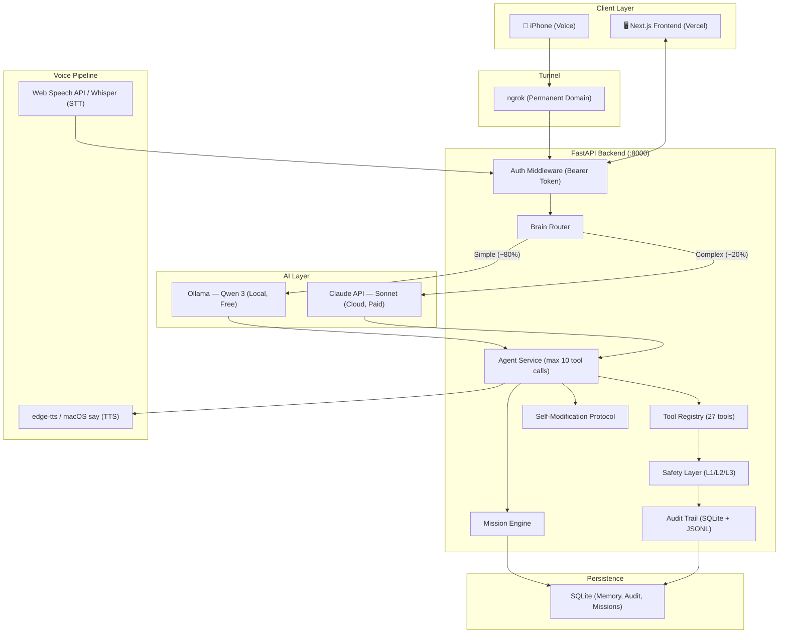

<div align="center">

# 🧠 Aura v1

**Autonomous Personal AI Agent — Voice-driven, dual-brain architecture, 3-tier autonomy**


[Architecture](#architecture) · [Getting Started](#getting-started) · [Testing](#testing)

</div>

---

## The Problem

Current AI assistants are cloud-only, have no offline capability, no real tool execution, and zero privacy. They respond to prompts — they don't act. Every interaction requires manual copy-paste between the assistant and the tools you actually use. There is no local-first, voice-driven AI that controls your machine, respects autonomy boundaries, and costs near-zero to run daily.

## The Solution

Aura is a **local-first personal AI agent** that takes voice commands from an iPhone, routes them through a dual-brain architecture (free local Ollama for simple tasks, Claude API for complex reasoning), executes real actions on macOS via 27 registered tools, and enforces a 3-tier autonomy system where dangerous operations are **hardcoded blocked** — no prompt injection, no config override, no exceptions.

---

## Architecture



### Dual-Brain Architecture

The `BrainRouter` classifies every incoming message by complexity using regex pattern matching and routes accordingly:

| Brain | Model | When | Cost |
|-------|-------|------|------|
| **Local** | Qwen 3 via Ollama | Greetings, simple Q&A, confirmations, basic explanations | Free (~3 GB RAM) |
| **Cloud** | Claude Sonnet via API | Tool calling, multi-step planning, code analysis, debugging | ~3 cents/call, daily budget cap |

Ollama lifecycle is fully managed: auto-starts when a request needs the local model, auto-stops after 10 minutes idle to free RAM. No manual intervention required.

### Autonomy Guard

A 3-tier enforcement system implemented both in the Python backend (`SafetyService` + `ShellTool`) and in the TypeScript governance layer (`AutonomyGuard` in `packages/aura-core`):

| Level | Policy | Examples | Override |
|-------|--------|----------|----------|
| **L1** — Autonomous | Executes without asking | Read files, list directories, git status, search, system metrics | — |
| **L2** — Approval | Queued for user approval | Write files, deploy, git push, open apps, send email, install packages | User approves/rejects |
| **L3** — Blocked | **Never executes** | `rm -rf /`, force push, credential rotation, financial ops, legal actions, public posts | **Hardcoded — not promotable** |

**L3 enforcement is structural, not behavioral.** The `ShellTool` blocks dangerous commands via regex before they reach the OS. The TypeScript `AutonomyGuard` classifies actions across 6 categories (financial, legal, irreversible, security, reputation, professional) with frozen/immutable pattern arrays. Attempting to promote an L3 action throws an `AutonomyViolationError`. This is verified by dedicated tests including adversarial inputs, mixed-case evasion, and 1,000-cycle degradation checks.

### Self-Modification Protocol

When the user requests changes to Aura's own codebase, a dedicated pipeline activates:

1. **Detector** — Identifies if the request modifies Aura's source (backend, frontend, scripts, config)
2. **Planner** — Generates a modification plan with affected files, risk level, and restart requirements
3. **Executor** — Executes only after explicit approval, delegates to Claude Code CLI for implementation

---

## Features

All features listed below are implemented in the codebase and verified through tests or manual validation:

- **Voice commands** — Web Speech API (STT in browser) + Whisper (backend STT) + edge-tts / macOS `say` (TTS); works from iPhone via ngrok tunnel
- **27 tool modules** with real execution — shell, filesystem, git, browser, deploy, macOS control, Claude Code delegation, project management, and more
- **Dual brain** — Qwen 3 local (free, ~80% of requests) + Claude API Sonnet (complex reasoning, native tool calling)
- **Ollama lifecycle** — auto-starts on demand, auto-stops after 10 min idle, frees ~3 GB RAM
- **3-tier autonomy** — L1 autonomous, L2 approval queue, L3 hardcoded block with regex enforcement
- **Browser automation** — AppleScript + JavaScript DOM extraction (no Playwright, no screenshots, ~2 KB structured text vs ~500 KB image)
- **Web workflows** — pre-built templates for GitHub, Vercel, Supabase operations
- **Mission engine** — LLM-planned multi-step task execution with SQLite persistence and step-level status tracking
- **Knowledge extractor** — Learns user preferences, project context, and facts from conversations via pattern matching
- **Self-modification protocol** — Detector + Planner + Executor pipeline for safe changes to Aura's own codebase
- **File attachments** — PDF text extraction, ZIP listing, image/text processing
- **Safety layer** — Approval queue, rollback registry, audit trail (every tool call logged to SQLite with timestamp, params, result)
- **Boot automation** — macOS LaunchAgent with idempotent 5-phase boot script (env, Ollama, model, ngrok, stack)
- **Remote access** — ngrok permanent domain with bearer token auth middleware
- **13 frontend pages** — Chat workspace, dashboard, memory, projects, routines, workflows, settings, system metrics, trust/safety dashboard, remote control, swarm/jobs, and login
- **Mobile-first PWA** — Responsive layout with dedicated mobile components, touch-optimized

---

## Tech Stack

| Layer | Technology | Version |
|-------|-----------|---------|
| **Backend** | Python, FastAPI, uvicorn, Pydantic | 3.11+, 0.115.12, 0.34.0 |
| **Frontend** | Next.js, React, TypeScript, Tailwind CSS | 15.3, 19.1, 5.8, 3.4 |
| **State** | Zustand (frontend, SSR-safe), SQLite (backend) | 5.0 |
| **AI (Local)** | Ollama + Qwen 3 | Latest |
| **AI (Cloud)** | Claude API (Sonnet) via Anthropic SDK | anthropic >= 0.42.0 |
| **UI** | Framer Motion, Recharts, cmdk, Lucide, Sonner | See package.json |
| **Data Fetching** | TanStack React Query | 5.90 |
| **Infrastructure** | macOS, LaunchAgent, ngrok (permanent domain) | — |
| **Voice** | Web Speech API (browser STT), Whisper (backend STT), edge-tts / macOS say (TTS) | — |
| **Browser Control** | AppleScript + JS injection — DOM extraction | — |
| **Governance** | @aura/core (TypeScript: AutonomyGuard, EventBus) | 0.1.0 |

---

## Project Structure

```
aura_v1/
├── aura/
│   ├── backend/                           # Python/FastAPI
│   │   ├── app/
│   │   │   ├── main.py                    # FastAPI app, lifespan, DI container
│   │   │   ├── api/v1/                    # 41 endpoint modules
│   │   │   ├── services/                  # 48 business logic services
│   │   │   │   ├── brain_router.py        # LOCAL/CLOUD routing by complexity
│   │   │   │   ├── agent_service.py       # Tool calling orchestrator (max 10 loops)
│   │   │   │   ├── ollama_lifecycle.py    # Auto start/stop with 10min idle timer
│   │   │   │   ├── claude_client.py       # Claude API via httpx
│   │   │   │   ├── safety_service.py      # L1/L2/L3 enforcement + audit
│   │   │   │   ├── mission_engine.py      # Multi-step task planner + executor
│   │   │   │   ├── sqlite_memory.py       # Preferences, projects, long-term memory
│   │   │   │   ├── self_mod_detector.py   # Detects self-modification requests
│   │   │   │   ├── self_mod_planner.py    # Generates modification plans
│   │   │   │   ├── self_mod_executor.py   # Executes approved modifications
│   │   │   │   ├── knowledge_extractor.py # Extracts facts from conversations
│   │   │   │   └── ...
│   │   │   └── tools/                     # 27 tool modules
│   │   │       ├── tool_registry.py       # BaseTool, ToolRegistry, AutonomyLevel
│   │   │       ├── shell_tool.py          # Shell with L3 regex blocking
│   │   │       ├── browser_navigator.py   # DOM extraction + AppleScript
│   │   │       ├── web_workflows.py       # GitHub/Vercel/Supabase templates
│   │   │       └── ...
│   │   ├── tests/                         # 17 pytest test files
│   │   └── requirements.txt
│   └── frontend/                          # Next.js 15 App Router
│       ├── app/                           # 13 pages (chat, dashboard, memory, ...)
│       ├── components/                    # chat, layout, mobile, editor, terminal, ...
│       ├── lib/                           # Zustand stores, API client, utils
│       └── middleware.ts                  # Auth guard (cookie-based)
├── packages/
│   ├── aura-core/                         # TypeScript: AutonomyGuard, EventBus, governance
│   └── aura-brain-claude/                 # TypeScript: Claude integration layer
├── scripts/                               # 19 operational scripts
│   ├── boot.sh                            # 5-phase boot: env → Ollama → model → ngrok → stack
│   ├── install-launch-agents              # macOS auto-start on login
│   ├── doctor                             # Health diagnostics
│   └── ...
├── config/models.yaml                     # Model routing configuration
├── docs/                                  # Architecture, security, product docs
└── CLAUDE.md                              # AI assistant project context
```

---

## Getting Started

### Prerequisites

- **macOS** (AppleScript-based tools are macOS-only)
- **Python 3.11+**
- **Node.js 18+** and **pnpm**
- **Ollama** ([install](https://ollama.com))

### 1. Clone

```bash
git clone https://github.com/GregoryGSPinto/aura_v1.git
cd aura_v1
```

### 2. Backend

```bash
cd aura/backend
python3 -m venv .venv
source .venv/bin/activate
pip install -r requirements.txt
cp .env.example .env
# Edit .env — at minimum set AURA_AUTH_TOKEN
uvicorn app.main:app --reload --port 8000
```

### 3. Frontend

```bash
cd aura/frontend
pnpm install
cp .env.example .env.local
# Set NEXT_PUBLIC_API_URL=http://localhost:8000
pnpm dev
```

### 4. Ollama + Model

```bash
ollama serve
ollama pull qwen3:latest
```

### 5. Production Boot

```bash
# One-time: install macOS LaunchAgent for auto-start on login
./scripts/install-launch-agents

# Manual start (runs all 5 phases):
./scripts/boot.sh
```

The boot script is idempotent — checks Ollama, pulls the model if missing, starts ngrok, and launches the full stack. Under LaunchAgent with `KeepAlive=true`, the entire stack restarts automatically on crash.

### 6. Remote Access

The boot script starts an ngrok tunnel with a permanent domain. Access Aura from your phone at the configured URL. All requests require a bearer token via `Authorization` header.

---

## Testing

### Test Inventory

| Layer | Framework | Files | Description |
|-------|-----------|-------|-------------|
| **Backend** | pytest | 17 test files | Unit tests for tool calling, chat routing, safety, streaming, voice, providers, connectors, and more |
| **Governance (TS)** | Vitest | 2 test files | AutonomyGuard (L1/L2/L3 classification, L3 immutability, adversarial inputs, performance) |
| **Total** | — | **19 test suites** | — |

### Running Tests

```bash
# Backend (pytest)
cd aura/backend
source .venv/bin/activate
pytest tests/ -v

# Governance (TypeScript)
cd packages/aura-core
node --import tsx --test __tests__/**/*.test.ts
```

### Key Safety Tests

The `autonomy-guard.test.ts` suite includes:
- **L3 hardcoded blocks** across 6 categories: financial, legal, irreversible, security, reputation, professional
- **L3 promotion impossibility** — `AutonomyViolationError` thrown on any attempt
- **L3 degradation resistance** — verified stable after 1,000 classification cycles
- **Adversarial inputs** — mixed case, special characters, embedded keywords in long strings, Portuguese
- **Performance** — 10,000 classifications in under 1 second

---

## Design Decisions

| Decision | Rationale |
|----------|-----------|
| **Dual brain over single model** | Qwen handles ~80% of requests at zero cost; Claude handles the rest that need reasoning. Budget configurable per day. |
| **L3 is hardcoded** | Dangerous actions blocked at the tool level with regex and frozen pattern arrays, not by prompt instructions. No config can promote an L3 action. |
| **AppleScript over Playwright** | Zero dependencies, no browser binary to manage. DOM extraction via JS injection gives structured data without screenshots. |
| **DOM extraction over screenshots** | ~2 KB structured text vs ~500 KB image. Faster, cheaper, works with any text-based LLM. |
| **Agent loop with cap** | Up to 10 tool calls per message prevents infinite loops while allowing multi-step tasks. |
| **Ollama lifecycle management** | Auto-starts when needed, auto-stops after 10 min idle. Keeps ~3 GB RAM free when not in use. |
| **SQLite over Postgres** | Single-user system. No connection pooling or network overhead needed. Memory, audit, and state all in local SQLite. |
| **Self-modification protocol** | Aura can modify its own code, but only through a Detector → Planner → Executor pipeline requiring explicit approval. |

---

## Roadmap

### Completed
- [x] FastAPI backend with 41 API endpoint modules
- [x] Next.js 15 frontend with 13 pages (PWA, mobile-first)
- [x] Brain Router (local/cloud classification by complexity)
- [x] 27-tool Agent Service with 3-tier autonomy enforcement
- [x] Ollama lifecycle (auto start/stop with 10 min idle timer)
- [x] Mission engine (LLM plan + step execution + SQLite persistence)
- [x] Safety layer (approval queue, audit trail, rollback registry)
- [x] Browser automation via AppleScript + DOM extraction
- [x] Voice pipeline (Web Speech API + Whisper + edge-tts)
- [x] Boot automation (macOS LaunchAgent, 5-phase idempotent script)
- [x] Remote access (ngrok permanent domain + auth middleware)
- [x] File upload and attachment processing
- [x] Self-modification protocol (detect, plan, execute with approval)
- [x] Knowledge extraction from conversations

### Planned
- [ ] Persistent Claude API budget tracking (currently resets on restart)
- [ ] Proactive engine activation (implemented but not started in lifespan)
- [ ] Mission V2 integration (SmartRetry, Replanner exist but not wired)
- [ ] Calendar and Gmail integration (services exist, need API keys)
- [ ] Vector memory for semantic search
- [ ] Multi-device presence system

---

## Philosophy

> "Technology exists to return time to family — not to consume more of it."

Every feature is measured against one metric: **how many real hours does it return?** Aura automates the repetitive so the human can focus on what matters.

---

## Author

**Gregory Guimaraes Pinto** — Senior AI Solution Architect

Train operator (railway) and self-taught software engineer. Built Aura as a personal AI ecosystem to automate daily workflows and reclaim time for family.

- GitHub: [github.com/GregoryGSPinto](https://github.com/GregoryGSPinto)

---

## License

Private — Personal use only.
