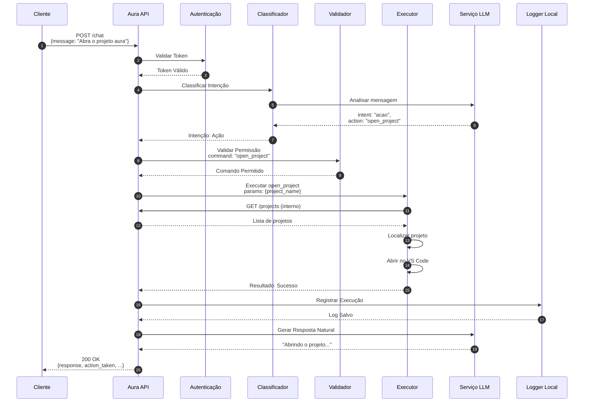
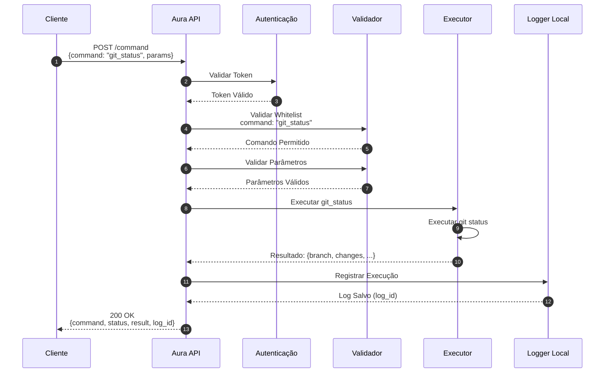
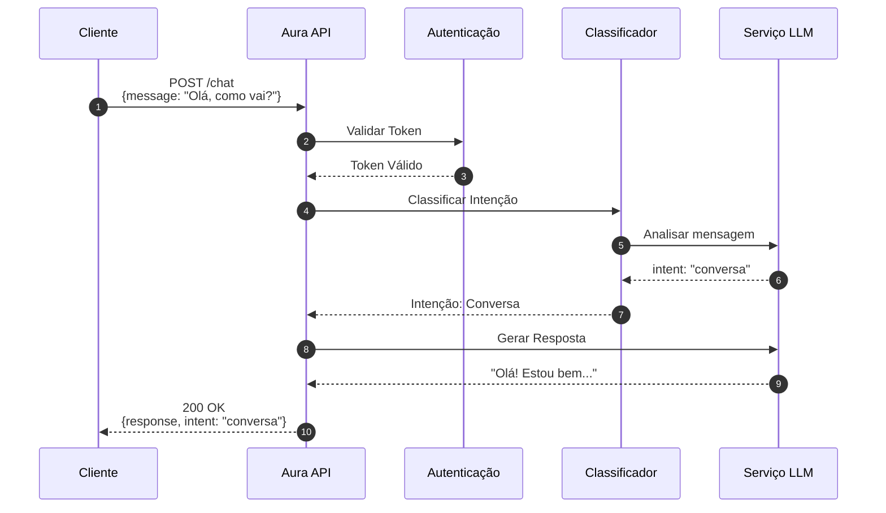

# Especificação da API - Aura v1

---

## 1. Visão Geral da API

| Atributo | Valor |
|----------|-------|
| **Base URL** | `http://localhost:8000` (desenvolvimento) / `https://api.aura.local` (produção) |
| **Versão** | v1 |
| **Formato** | JSON |
| **Content-Type** | `application/json` |
| **Autenticação** | Bearer Token (header `Authorization: Bearer <token>`) |

### Formato de Resposta Padrão

Todas as respostas seguem o padrão:

```json
{
  "success": true,
  "data": {},
  "error": null,
  "timestamp": "2024-01-15T10:30:00Z"
}
```

| Campo | Tipo | Descrição |
|-------|------|-----------|
| `success` | boolean | Indica se a operação foi bem-sucedida |
| `data` | object/array | Dados da resposta (quando sucesso=true) |
| `error` | object/null | Detalhes do erro (quando sucesso=false) |
| `timestamp` | string | ISO 8601 timestamp da resposta |

---

## 2. Endpoints Detalhados

---

### 2.1 Status do Servidor

#### `GET /status`

| Atributo | Valor |
|----------|-------|
| **Método** | GET |
| **Path** | `/status` |
| **Descrição** | Retorna o status atual do servidor, versão da API e informações de saúde |
| **Autenticação** | Não |

**Request:**
```bash
curl -X GET http://localhost:8000/status
```

**Response 200:**
```json
{
  "success": true,
  "data": {
    "status": "healthy",
    "version": "1.0.0",
    "uptime_seconds": 3600,
    "timestamp": "2024-01-15T10:30:00Z",
    "services": {
      "api": "online",
      "llm": "online",
      "filesystem": "online"
    }
  },
  "error": null,
  "timestamp": "2024-01-15T10:30:00Z"
}
```

**Códigos de Status:**

| Código | Descrição |
|--------|-----------|
| 200 | Servidor operacional |
| 503 | Serviço indisponível (um ou mais serviços offline) |

---

### 2.2 Chat

#### `POST /chat`

| Atributo | Valor |
|----------|-------|
| **Método** | POST |
| **Path** | `/chat` |
| **Descrição** | Envia uma mensagem para a Aura e recebe resposta processada pelo LLM |
| **Autenticação** | Sim - Bearer Token |

**Request:**
```json
{
  "message": "Quais são os projetos ativos?",
  "context": {
    "project_id": null,
    "session_id": "sess_abc123",
    "history": [
      {
        "role": "user",
        "content": "Olá Aura",
        "timestamp": "2024-01-15T10:25:00Z"
      }
    ]
  },
  "options": {
    "stream": false,
    "temperature": 0.7
  }
}
```

**Response 200:**
```json
{
  "success": true,
  "data": {
    "response": "Você tem 3 projetos ativos: aura-backend, dashboard-app e api-docs.",
    "intent": "consulta",
    "action_taken": null,
    "session_id": "sess_abc123",
    "tokens_used": 245,
    "processing_time_ms": 890
  },
  "error": null,
  "timestamp": "2024-01-15T10:30:05Z"
}
```

**Response 200 (com ação):**
```json
{
  "success": true,
  "data": {
    "response": "Abrindo o projeto aura-backend no VS Code...",
    "intent": "acao",
    "action_taken": {
      "command": "open_project",
      "params": {
        "project_name": "aura-backend"
      },
      "status": "executed",
      "result": {
        "success": true,
        "message": "Projeto aberto com sucesso"
      }
    },
    "session_id": "sess_abc123",
    "tokens_used": 312,
    "processing_time_ms": 1250
  },
  "error": null,
  "timestamp": "2024-01-15T10:30:05Z"
}
```

**Códigos de Status:**

| Código | Descrição |
|--------|-----------|
| 200 | Mensagem processada com sucesso |
| 400 | Requisição inválida (mensagem vazia ou formato incorreto) |
| 401 | Token de autenticação ausente ou inválido |
| 429 | Limite de requisições excedido |
| 500 | Erro interno do servidor ou falha no LLM |

---

### 2.3 Comando

#### `POST /command`

| Atributo | Valor |
|----------|-------|
| **Método** | POST |
| **Path** | `/command` |
| **Descrição** | Executa uma ação direta no sistema (whitelist de comandos) |
| **Autenticação** | Sim - Bearer Token |

**Request:**
```json
{
  "command": "open_project",
  "params": {
    "project_name": "aura-backend"
  },
  "options": {
    "confirm": false,
    "async": false
  }
}
```

**Response 200:**
```json
{
  "success": true,
  "data": {
    "command": "open_project",
    "status": "success",
    "result": {
      "project": "aura-backend",
      "path": "/home/user/projects/aura-backend",
      "opened_in": "vscode",
      "timestamp": "2024-01-15T10:30:10Z"
    },
    "execution_time_ms": 450,
    "log_id": "log_789xyz"
  },
  "error": null,
  "timestamp": "2024-01-15T10:30:10Z"
}
```

**Response 400 (comando não permitido):**
```json
{
  "success": false,
  "data": null,
  "error": {
    "code": "COMMAND_NOT_ALLOWED",
    "message": "Comando 'delete_file' não está na whitelist de comandos permitidos",
    "allowed_commands": [
      "open_vscode",
      "open_project",
      "list_projects",
      "run_project_dev",
      "git_status",
      "vercel_deploy",
      "show_logs"
    ]
  },
  "timestamp": "2024-01-15T10:30:10Z"
}
```

**Códigos de Status:**

| Código | Descrição |
|--------|-----------|
| 200 | Comando executado com sucesso |
| 400 | Comando inválido ou parâmetros incorretos |
| 401 | Token de autenticação ausente ou inválido |
| 403 | Comando não permitido (não está na whitelist) |
| 422 | Parâmetros obrigatórios ausentes |
| 500 | Erro na execução do comando |

---

### 2.4 Listar Projetos

#### `GET /projects`

| Atributo | Valor |
|----------|-------|
| **Método** | GET |
| **Path** | `/projects` |
| **Descrição** | Retorna a lista de projetos disponíveis no workspace |
| **Autenticação** | Sim - Bearer Token |

**Request:**
```bash
curl -X GET http://localhost:8000/projects \
  -H "Authorization: Bearer <token>"
```

**Query Parameters:**

| Parâmetro | Tipo | Obrigatório | Descrição |
|-----------|------|-------------|-----------|
| `status` | string | Não | Filtrar por status: `active`, `archived`, `all` |
| `sort_by` | string | Não | Ordenar por: `name`, `modified`, `created` |
| `limit` | integer | Não | Limite de resultados (padrão: 50, max: 100) |

**Response 200:**
```json
{
  "success": true,
  "data": {
    "projects": [
      {
        "id": "proj_001",
        "name": "aura-backend",
        "path": "/home/user/projects/aura-backend",
        "type": "python",
        "framework": "fastapi",
        "status": "active",
        "last_modified": "2024-01-15T09:00:00Z",
        "git": {
          "has_repo": true,
          "branch": "main",
          "uncommitted_changes": 3
        }
      },
      {
        "id": "proj_002",
        "name": "dashboard-app",
        "path": "/home/user/projects/dashboard-app",
        "type": "javascript",
        "framework": "react",
        "status": "active",
        "last_modified": "2024-01-14T16:30:00Z",
        "git": {
          "has_repo": true,
          "branch": "feature/new-ui",
          "uncommitted_changes": 0
        }
      },
      {
        "id": "proj_003",
        "name": "api-docs",
        "path": "/home/user/projects/api-docs",
        "type": "markdown",
        "framework": null,
        "status": "archived",
        "last_modified": "2024-01-10T11:00:00Z",
        "git": {
          "has_repo": false,
          "branch": null,
          "uncommitted_changes": 0
        }
      }
    ],
    "total": 3,
    "workspace_path": "/home/user/projects"
  },
  "error": null,
  "timestamp": "2024-01-15T10:30:15Z"
}
```

**Códigos de Status:**

| Código | Descrição |
|--------|-----------|
| 200 | Lista retornada com sucesso |
| 401 | Token de autenticação ausente ou inválido |
| 500 | Erro ao acessar diretório de projetos |

---

### 2.5 Abrir Projeto

#### `POST /projects/open`

| Atributo | Valor |
|----------|-------|
| **Método** | POST |
| **Path** | `/projects/open` |
| **Descrição** | Abre um projeto específico no VS Code |
| **Autenticação** | Sim - Bearer Token |

**Request:**
```json
{
  "project_name": "aura-backend",
  "options": {
    "new_window": false,
    "goto_file": null
  }
}
```

**Response 200:**
```json
{
  "success": true,
  "data": {
    "project": {
      "id": "proj_001",
      "name": "aura-backend",
      "path": "/home/user/projects/aura-backend"
    },
    "opened": true,
    "editor": "vscode",
    "window": "same",
    "timestamp": "2024-01-15T10:30:20Z"
  },
  "error": null,
  "timestamp": "2024-01-15T10:30:20Z"
}
```

**Response 404 (projeto não encontrado):**
```json
{
  "success": false,
  "data": null,
  "error": {
    "code": "PROJECT_NOT_FOUND",
    "message": "Projeto 'projeto-inexistente' não encontrado no workspace",
    "available_projects": [
      "aura-backend",
      "dashboard-app",
      "api-docs"
    ]
  },
  "timestamp": "2024-01-15T10:30:20Z"
}
```

**Códigos de Status:**

| Código | Descrição |
|--------|-----------|
| 200 | Projeto aberto com sucesso |
| 400 | Nome do projeto não fornecido |
| 401 | Token de autenticação ausente ou inválido |
| 404 | Projeto não encontrado |
| 500 | Erro ao abrir projeto no VS Code |

---

## 3. Schemas de Dados

### 3.1 ChatRequest

| Campo | Tipo | Obrigatório | Descrição |
|-------|------|-------------|-----------|
| `message` | string | Sim | Mensagem do usuário para processamento |
| `context` | object | Não | Contexto da conversa |
| `context.project_id` | string/null | Não | ID do projeto atual (se aplicável) |
| `context.session_id` | string | Não | ID da sessão de chat |
| `context.history` | array | Não | Histórico de mensagens anteriores |
| `options` | object | Não | Opções de processamento |
| `options.stream` | boolean | Não | Retornar resposta em streaming (padrão: false) |
| `options.temperature` | float | Não | Temperatura do LLM 0.0-1.0 (padrão: 0.7) |

### 3.2 ChatResponse

| Campo | Tipo | Descrição |
|-------|------|-----------|
| `response` | string | Resposta textual da Aura |
| `intent` | string | Intenção detectada: `conversa`, `consulta`, `acao` |
| `action_taken` | object/null | Detalhes da ação executada (se intent=acao) |
| `action_taken.command` | string | Comando executado |
| `action_taken.params` | object | Parâmetros do comando |
| `action_taken.status` | string | Status da execução |
| `action_taken.result` | object | Resultado da execução |
| `session_id` | string | ID da sessão de chat |
| `tokens_used` | integer | Tokens consumidos no processamento |
| `processing_time_ms` | integer | Tempo de processamento em milissegundos |

### 3.3 CommandRequest

| Campo | Tipo | Obrigatório | Descrição |
|-------|------|-------------|-----------|
| `command` | string | Sim | Comando a ser executado (whitelist) |
| `params` | object | Não | Parâmetros específicos do comando |
| `options` | object | Não | Opções de execução |
| `options.confirm` | boolean | Não | Requer confirmação antes de executar |
| `options.async` | boolean | Não | Executar de forma assíncrona |

### 3.4 CommandResponse

| Campo | Tipo | Descrição |
|-------|------|-----------|
| `command` | string | Comando executado |
| `status` | string | Status: `success`, `error`, `pending` |
| `result` | object | Resultado da execução (varia por comando) |
| `execution_time_ms` | integer | Tempo de execução |
| `log_id` | string | ID do log de execução |

### 3.5 Project

| Campo | Tipo | Descrição |
|-------|------|-----------|
| `id` | string | Identificador único do projeto |
| `name` | string | Nome do projeto |
| `path` | string | Caminho absoluto do projeto |
| `type` | string | Tipo: `python`, `javascript`, `markdown`, etc |
| `framework` | string/null | Framework utilizado (ex: `fastapi`, `react`) |
| `status` | string | Status: `active`, `archived` |
| `last_modified` | string | ISO 8601 timestamp da última modificação |
| `git` | object | Informações do Git |
| `git.has_repo` | boolean | Possui repositório Git |
| `git.branch` | string/null | Branch atual |
| `git.uncommitted_changes` | integer | Número de alterações não commitadas |

### 3.6 StatusResponse

| Campo | Tipo | Descrição |
|-------|------|-----------|
| `status` | string | Status geral: `healthy`, `degraded`, `unhealthy` |
| `version` | string | Versão da API |
| `uptime_seconds` | integer | Tempo de atividade do servidor |
| `timestamp` | string | ISO 8601 timestamp da resposta |
| `services` | object | Status dos serviços |
| `services.api` | string | Status da API: `online`, `offline` |
| `services.llm` | string | Status do serviço LLM |
| `services.filesystem` | string | Status do acesso ao filesystem |

### 3.7 ErrorResponse

| Campo | Tipo | Descrição |
|-------|------|-----------|
| `code` | string | Código do erro |
| `message` | string | Mensagem descritiva do erro |
| `details` | object | Detalhes adicionais (opcional) |
| `allowed_commands` | array | Lista de comandos permitidos (quando aplicável) |
| `available_projects` | array | Lista de projetos disponíveis (quando aplicável) |

---

## 4. Fluxo de Chamadas

### 4.1 Fluxo Completo: Chat com Ação



### 4.2 Fluxo: Comando Direto



### 4.3 Fluxo: Consulta Simples



---

## 5. Whitelist de Comandos

| Comando | Descrição | Parâmetros |
|---------|-----------|------------|
| `open_vscode` | Abre o VS Code | `path` (opcional) |
| `open_project` | Abre projeto específico | `project_name` (obrigatório) |
| `list_projects` | Lista projetos do workspace | - |
| `run_project_dev` | Inicia servidor de desenvolvimento | `project_name` (obrigatório) |
| `git_status` | Mostra status do Git | `project_name` (opcional) |
| `vercel_deploy` | Faz deploy na Vercel | `project_name` (obrigatório) |
| `show_logs` | Exibe logs do projeto | `project_name`, `lines` (opcional, padrão: 50) |

---

## 6. Códigos de Erro

| Código | Descrição | HTTP Status |
|--------|-----------|-------------|
| `INVALID_REQUEST` | Requisição mal formatada | 400 |
| `MISSING_PARAMETER` | Parâmetro obrigatório ausente | 422 |
| `COMMAND_NOT_ALLOWED` | Comando não está na whitelist | 403 |
| `PROJECT_NOT_FOUND` | Projeto não encontrado | 404 |
| `AUTHENTICATION_REQUIRED` | Token de autenticação ausente | 401 |
| `INVALID_TOKEN` | Token inválido ou expirado | 401 |
| `RATE_LIMIT_EXCEEDED` | Limite de requisições excedido | 429 |
| `LLM_SERVICE_ERROR` | Erro no serviço LLM | 500 |
| `COMMAND_EXECUTION_ERROR` | Erro na execução do comando | 500 |
| `INTERNAL_ERROR` | Erro interno do servidor | 500 |

---

## 7. Exemplos de Uso

### 7.1 Verificar Status
```bash
curl -X GET http://localhost:8000/status
```

### 7.2 Enviar Mensagem de Chat
```bash
curl -X POST http://localhost:8000/chat \
  -H "Authorization: Bearer seu_token_aqui" \
  -H "Content-Type: application/json" \
  -d '{
    "message": "Liste meus projetos",
    "context": {
      "session_id": "sess_123"
    }
  }'
```

### 7.3 Executar Comando
```bash
curl -X POST http://localhost:8000/command \
  -H "Authorization: Bearer seu_token_aqui" \
  -H "Content-Type: application/json" \
  -d '{
    "command": "git_status",
    "params": {
      "project_name": "aura-backend"
    }
  }'
```

### 7.4 Listar Projetos
```bash
curl -X GET "http://localhost:8000/projects?status=active&sort_by=modified" \
  -H "Authorization: Bearer seu_token_aqui"
```

### 7.5 Abrir Projeto
```bash
curl -X POST http://localhost:8000/projects/open \
  -H "Authorization: Bearer seu_token_aqui" \
  -H "Content-Type: application/json" \
  -d '{
    "project_name": "aura-backend",
    "options": {
      "new_window": false
    }
  }'
```
