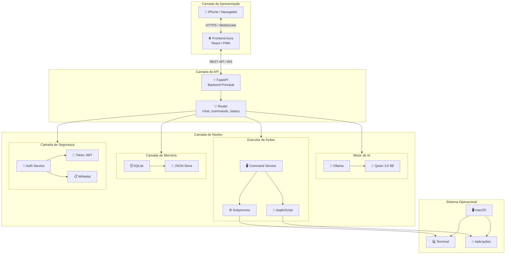
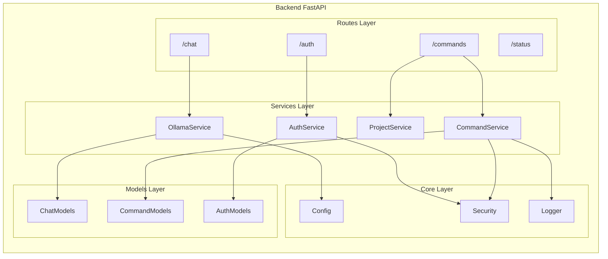
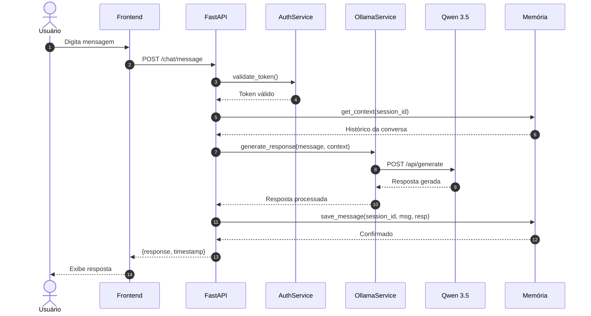
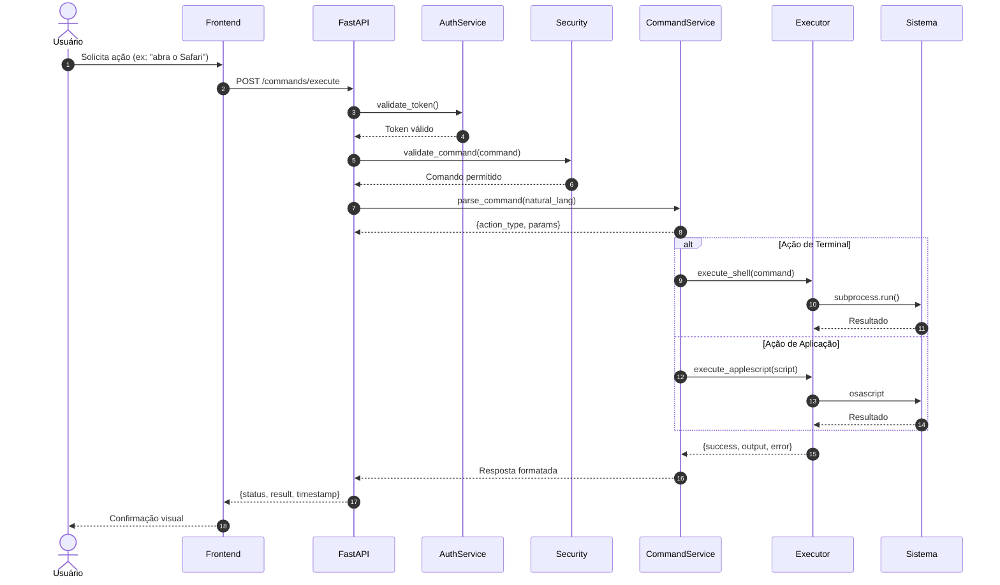
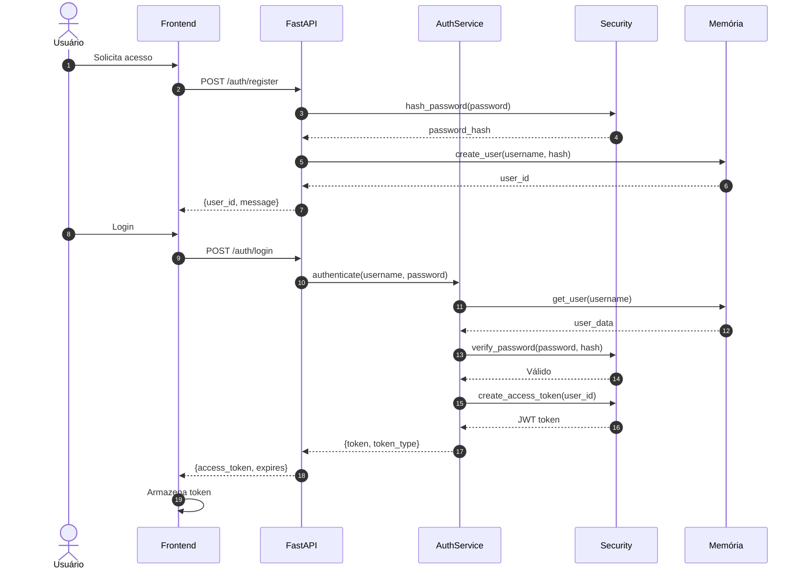
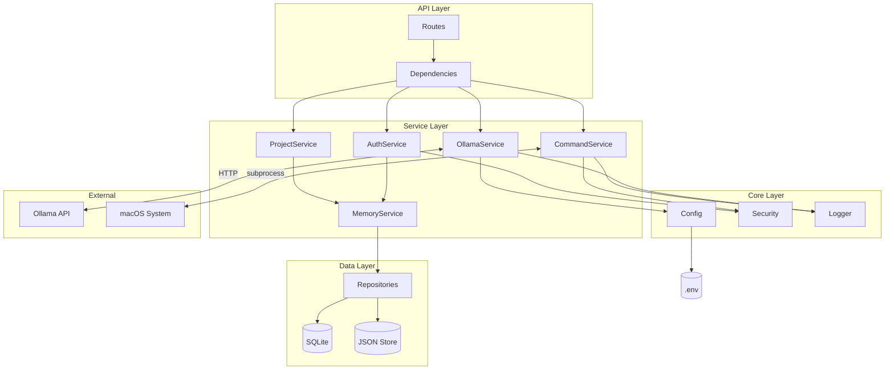

# Blueprint Aura v1 - Arquitetura e Estrutura de Módulos

---

## 1. Visão Geral da Arquitetura

### 1.1 Diagrama de Arquitetura Macro



### 1.2 Descrição das Camadas

| Camada | Responsabilidade | Tecnologia Principal |
|--------|------------------|---------------------|
| **Apresentação** | Interface do usuário, chat, histórico, botões rápidos | React, PWA, WebSocket |
| **API** | Roteamento, validação, orquestração de serviços | FastAPI, Pydantic, Uvicorn |
| **Motor de IA** | Processamento de linguagem natural, geração de respostas | Ollama, Qwen 3.5 9B |
| **Executor** | Execução de comandos no sistema operacional | Python subprocess, AppleScript |
| **Memória** | Persistência de conversas, projetos, configurações | SQLite, JSON |
| **Segurança** | Autenticação, autorização, validação de comandos | JWT, Whitelist |

---

## 2. Componentes do Sistema

### 2.1 Tabela de Componentes

| Componente | Tecnologia | Responsabilidade | Status |
|------------|------------|------------------|--------|
| **Frontend Aura** | React 18, TypeScript, Tailwind CSS | Interface web responsiva, chat em tempo real, histórico de conversas | Core |
| **Backend API** | FastAPI, Python 3.11, Uvicorn | Endpoints REST, WebSocket, validação de requests | Core |
| **Motor LLM** | Ollama 0.3+, Qwen 3.5 9B | Inferência local, processamento de linguagem natural | Core |
| **Serviço de Comandos** | Python, subprocess, os | Execução segura de comandos no terminal | Core |
| **Serviço de Projetos** | Python, pathlib, gitpython | Gerenciamento de projetos, navegação de diretórios | Core |
| **Serviço de Autenticação** | Python-Jose, bcrypt | Validação de tokens, controle de acesso | Core |
| **Camada de Memória** | SQLite3, JSON | Persistência de conversas, configurações, cache | Core |
| **Logger** | Python logging, structlog | Registro de eventos, auditoria de comandos | Support |
| **Config Manager** | Pydantic Settings, python-dotenv | Gerenciamento de variáveis de ambiente | Support |

### 2.2 Diagrama de Componentes Internos



---

## 3. Diagrama de Fluxo Principal

### 3.1 Fluxo de Conversa (Chat)



### 3.2 Fluxo de Comando Operacional



### 3.3 Fluxo de Autenticação



---

## 4. Estrutura de Pastas Detalhada

### 4.1 Árvore Completa do Projeto

```
aura/
├── 📁 backend/                          # Backend FastAPI
│   ├── 📁 app/                          # Código fonte principal
│   │   ├── 📄 __init__.py
│   │   ├── 📄 main.py                   # Entry point da aplicação
│   │   │
│   │   ├── 📁 api/                      # Camada de API
│   │   │   ├── 📄 __init__.py
│   │   │   ├── 📁 v1/                   # Versão 1 da API
│   │   │   │   ├── 📄 __init__.py
│   │   │   │   ├── 📁 endpoints/        # Endpoints agrupados
│   │   │   │   │   ├── 📄 __init__.py
│   │   │   │   │   ├── 📄 chat.py       # /chat/* endpoints
│   │   │   │   │   ├── 📄 commands.py   # /commands/* endpoints
│   │   │   │   │   ├── 📄 status.py     # /status/* endpoints
│   │   │   │   │   └── 📄 auth.py       # /auth/* endpoints
│   │   │   │   └── 📄 router.py         # Agregador de rotas v1
│   │   │   └── 📄 deps.py               # Dependências injetáveis
│   │   │
│   │   ├── 📁 core/                     # Camada de núcleo
│   │   │   ├── 📄 __init__.py
│   │   │   ├── 📄 config.py             # Configurações (Pydantic Settings)
│   │   │   ├── 📄 security.py           # JWT, hashing, validação
│   │   │   ├── 📄 logger.py             # Configuração de logging
│   │   │   └── 📄 exceptions.py         # Exceções customizadas
│   │   │
│   │   ├── 📁 models/                   # Modelos de dados (Pydantic)
│   │   │   ├── 📄 __init__.py
│   │   │   ├── 📄 chat_models.py        # Schemas de chat
│   │   │   ├── 📄 command_models.py     # Schemas de comandos
│   │   │   ├── 📄 auth_models.py        # Schemas de autenticação
│   │   │   └── 📄 common_models.py      # Schemas compartilhados
│   │   │
│   │   ├── 📁 services/                 # Camada de serviços
│   │   │   ├── 📄 __init__.py
│   │   │   ├── 📄 ollama_service.py     # Comunicação com Ollama
│   │   │   ├── 📄 command_service.py    # Execução de comandos
│   │   │   ├── 📄 project_service.py    # Gerenciamento de projetos
│   │   │   ├── 📄 auth_service.py       # Lógica de autenticação
│   │   │   └── 📄 memory_service.py     # Operações de memória
│   │   │
│   │   ├── 📁 db/                       # Camada de persistência
│   │   │   ├── 📄 __init__.py
│   │   │   ├── 📄 base.py               # Base declarativa SQLAlchemy
│   │   │   ├── 📄 session.py            # Gerenciamento de sessões
│   │   │   ├── 📁 migrations/           # Alembic migrations
│   │   │   └── 📁 repositories/         # Repositories pattern
│   │   │       ├── 📄 __init__.py
│   │   │       ├── 📄 chat_repository.py
│   │   │       ├── 📄 user_repository.py
│   │   │       └── 📄 project_repository.py
│   │   │
│   │   └── 📁 utils/                    # Utilitários
│   │       ├── 📄 __init__.py
│   │       ├── 📄 validators.py         # Validações customizadas
│   │       ├── 📄 formatters.py         # Formatadores de texto
│   │       └── 📄 helpers.py            # Funções auxiliares
│   │
│   ├── 📁 data/                         # Dados persistentes
│   │   ├── 📄 .gitkeep
│   │   ├── 📁 sqlite/                   # Bancos SQLite
│   │   │   ├── 📄 aura.db               # Banco principal
│   │   │   └── 📄 aura_test.db          # Banco de testes
│   │   ├── 📁 json/                     # Armazenamento JSON
│   │   │   ├── 📄 settings.json         # Configurações do usuário
│   │   │   ├── 📄 projects.json         # Metadados de projetos
│   │   │   └── 📄 shortcuts.json        # Atalhos customizados
│   │   └── 📁 logs/                     # Logs da aplicação
│   │       ├── 📄 app.log               # Log principal
│   │       └── 📄 commands.log          # Log de comandos executados
│   │
│   ├── 📁 scripts/                      # Scripts auxiliares
│   │   ├── 📄 setup.sh                  # Script de setup inicial
│   │   ├── 📄 reset_db.sh               # Reset do banco de dados
│   │   └── 📄 backup.sh                 # Backup de dados
│   │
│   ├── 📁 tests/                        # Testes
│   │   ├── 📄 __init__.py
│   │   ├── 📄 conftest.py               # Configuração pytest
│   │   ├── 📁 unit/                     # Testes unitários
│   │   │   ├── 📄 test_services.py
│   │   │   └── 📄 test_security.py
│   │   ├── 📁 integration/              # Testes de integração
│   │   │   ├── 📄 test_api.py
│   │   │   └── 📄 test_ollama.py
│   │   └── 📁 e2e/                      # Testes end-to-end
│   │       └── 📄 test_chat_flow.py
│   │
│   ├── 📄 requirements.txt              # Dependências Python
│   ├── 📄 requirements-dev.txt          # Dependências de desenvolvimento
│   ├── 📄 .env.example                  # Template de variáveis de ambiente
│   ├── 📄 alembic.ini                   # Configuração Alembic
│   └── 📄 pytest.ini                    # Configuração pytest
│
├── 📁 frontend/                         # Frontend React
│   ├── 📁 public/                       # Assets públicos
│   │   ├── 📄 index.html
│   │   ├── 📄 manifest.json             # PWA manifest
│   │   ├── 📄 favicon.ico
│   │   └── 📁 icons/                    # Ícones PWA
│   │
│   ├── 📁 src/                          # Código fonte
│   │   ├── 📄 index.tsx                 # Entry point
│   │   ├── 📄 App.tsx                   # Componente raiz
│   │   ├── 📄 react-app-env.d.ts
│   │   │
│   │   ├── 📁 components/               # Componentes React
│   │   │   ├── 📁 common/               # Componentes compartilhados
│   │   │   │   ├── 📄 Button.tsx
│   │   │   │   ├── 📄 Input.tsx
│   │   │   │   └── 📄 Card.tsx
│   │   │   ├── 📁 chat/                 # Componentes de chat
│   │   │   │   ├── 📄 ChatContainer.tsx
│   │   │   │   ├── 📄 MessageList.tsx
│   │   │   │   ├── 📄 MessageItem.tsx
│   │   │   │   ├── 📄 ChatInput.tsx
│   │   │   │   └── 📄 TypingIndicator.tsx
│   │   │   ├── 📁 commands/             # Componentes de comandos
│   │   │   │   ├── 📄 CommandPalette.tsx
│   │   │   │   ├── 📄 QuickActions.tsx
│   │   │   │   └── 📄 CommandHistory.tsx
│   │   │   └── 📁 layout/               # Componentes de layout
│   │   │       ├── 📄 Header.tsx
│   │   │       ├── 📄 Sidebar.tsx
│   │   │       └── 📄 MainLayout.tsx
│   │   │
│   │   ├── 📁 hooks/                    # Custom hooks
│   │   │   ├── 📄 useChat.ts            # Hook de chat
│   │   │   ├── 📄 useCommands.ts        # Hook de comandos
│   │   │   ├── 📄 useAuth.ts            # Hook de autenticação
│   │   │   └── 📄 useWebSocket.ts       # Hook WebSocket
│   │   │
│   │   ├── 📁 services/                 # Serviços de API
│   │   │   ├── 📄 api.ts                # Configuração axios
│   │   │   ├── 📄 chatService.ts        # API de chat
│   │   │   ├── 📄 commandService.ts     # API de comandos
│   │   │   └── 📄 authService.ts        # API de autenticação
│   │   │
│   │   ├── 📁 store/                    # Estado global
│   │   │   ├── 📄 index.ts              # Store config
│   │   │   ├── 📄 chatSlice.ts          # Estado de chat
│   │   │   ├── 📄 authSlice.ts          # Estado de auth
│   │   │   └── 📄 commandSlice.ts       # Estado de comandos
│   │   │
│   │   ├── 📁 types/                    # Tipos TypeScript
│   │   │   ├── 📄 chat.types.ts
│   │   │   ├── 📄 command.types.ts
│   │   │   └── 📄 auth.types.ts
│   │   │
│   │   ├── 📁 utils/                    # Utilitários
│   │   │   ├── 📄 constants.ts          # Constantes
│   │   │   ├── 📄 formatters.ts         # Formatadores
│   │   │   └── 📄 validators.ts         # Validadores
│   │   │
│   │   └── 📁 styles/                   # Estilos
│   │       ├── 📄 globals.css
│   │       └── 📁 themes/               # Temas
│   │
│   ├── 📄 package.json                  # Dependências npm
│   ├── 📄 tsconfig.json                 # Configuração TypeScript
│   ├── 📄 tailwind.config.js            # Configuração Tailwind
│   └── 📄 .env.example                  # Template de env
│
├── 📁 docs/                             # Documentação
│   ├── 📄 architecture.md               # Documento de arquitetura
│   ├── 📄 api.md                        # Documentação da API
│   ├── 📄 roadmap.md                    # Roadmap do projeto
│   ├── 📄 deployment.md                 # Guia de deploy
│   └── 📁 diagrams/                     # Diagramas adicionais
│
├── 📁 scripts/                          # Scripts raiz
│   ├── 📄 start.sh                      # Inicia backend + frontend
│   ├── 📄 install.sh                    # Instala dependências
│   └── 📄 update.sh                     # Atualiza o sistema
│
├── 📄 README.md                         # Documentação principal
├── 📄 LICENSE                           # Licença
├── 📄 .gitignore                        # Git ignore
└── 📄 docker-compose.yml                # Configuração Docker (futuro)
```

### 4.2 Descrição de Diretórios Principais

| Diretório | Propósito | Conteúdo Típico |
|-----------|-----------|-----------------|
| `backend/app/api` | Camada de interface HTTP | Routers, endpoints, handlers |
| `backend/app/core` | Configurações e infraestrutura | Config, segurança, logging |
| `backend/app/models` | Contratos de dados | Pydantic models, schemas |
| `backend/app/services` | Lógica de negócio | Orquestração, processamento |
| `backend/app/db` | Persistência | SQLAlchemy, repositories |
| `backend/data` | Dados em runtime | SQLite, JSON, logs |
| `frontend/src/components` | UI React | Componentes funcionais |
| `frontend/src/services` | Cliente API | Axios, fetch wrappers |
| `frontend/src/store` | Estado | Redux Toolkit slices |

---

## 5. Interfaces entre Módulos

### 5.1 Contratos de Serviços

#### OllamaService Interface

```python
class OllamaService:
    """Interface para comunicação com Ollama LLM."""
    
    async def generate_response(
        self,
        message: str,
        context: List[Message],
        model: str = "qwen3.5:9b",
        temperature: float = 0.7
    ) -> LLMResponse:
        """Gera resposta do modelo LLM."""
        pass
    
    async def stream_response(
        self,
        message: str,
        context: List[Message],
        model: str = "qwen3.5:9b"
    ) -> AsyncIterator[str]:
        """Stream de resposta do modelo."""
        pass
    
    async def health_check(self) -> bool:
        """Verifica disponibilidade do Ollama."""
        pass
```

#### CommandService Interface

```python
class CommandService:
    """Interface para execução de comandos operacionais."""
    
    async def execute_command(
        self,
        command: str,
        command_type: CommandType,
        user_id: str,
        validate: bool = True
    ) -> CommandResult:
        """Executa comando no sistema."""
        pass
    
    async def parse_natural_command(
        self,
        natural_text: str
    ) -> ParsedCommand:
        """Converte linguagem natural em comando estruturado."""
        pass
    
    def validate_command(
        self,
        command: str,
        whitelist: List[str]
    ) -> ValidationResult:
        """Valida se comando é permitido."""
        pass
```

#### AuthService Interface

```python
class AuthService:
    """Interface para autenticação e autorização."""
    
    async def authenticate(
        self,
        username: str,
        password: str
    ) -> Optional[AuthToken]:
        """Autentica usuário e retorna token."""
        pass
    
    async def validate_token(
        self,
        token: str
    ) -> TokenPayload:
        """Valida token JWT."""
        pass
    
    async def create_user(
        self,
        user_data: UserCreate
    ) -> User:
        """Cria novo usuário."""
        pass
```

### 5.2 Modelos de Dados Principais

#### Chat Models

```python
class Message(BaseModel):
    """Modelo de mensagem de chat."""
    id: str = Field(default_factory=uuid4)
    session_id: str
    role: Literal["user", "assistant", "system"]
    content: str
    timestamp: datetime = Field(default_factory=datetime.utcnow)
    metadata: Optional[Dict[str, Any]] = None

class ChatRequest(BaseModel):
    """Request para endpoint de chat."""
    message: str = Field(..., min_length=1, max_length=4000)
    session_id: Optional[str] = None
    stream: bool = False

class ChatResponse(BaseModel):
    """Response do endpoint de chat."""
    message: Message
    session_id: str
    processing_time_ms: int
```

#### Command Models

```python
class CommandType(str, Enum):
    """Tipos de comando suportados."""
    SHELL = "shell"
    APPLESCRIPT = "applescript"
    SHORTCUT = "shortcut"
    WORKFLOW = "workflow"

class CommandRequest(BaseModel):
    """Request para execução de comando."""
    command: str
    type: CommandType = CommandType.SHELL
    working_dir: Optional[str] = None
    timeout: int = Field(default=30, ge=1, le=300)

class CommandResult(BaseModel):
    """Resultado da execução de comando."""
    success: bool
    output: Optional[str] = None
    error: Optional[str] = None
    exit_code: Optional[int] = None
    execution_time_ms: int
    timestamp: datetime
```

#### Auth Models

```python
class UserCreate(BaseModel):
    """Dados para criação de usuário."""
    username: str = Field(..., min_length=3, max_length=50)
    password: str = Field(..., min_length=8)
    email: Optional[EmailStr] = None

class TokenPayload(BaseModel):
    """Payload do token JWT."""
    sub: str  # user_id
    exp: datetime
    iat: datetime
    scopes: List[str] = []

class AuthToken(BaseModel):
    """Token de autenticação."""
    access_token: str
    token_type: str = "bearer"
    expires_in: int
```

### 5.3 Diagrama de Dependências entre Módulos



---

## 6. Tecnologias por Camada

### 6.1 Stack Tecnológico Completo

| Camada | Tecnologia | Versão | Propósito |
|--------|------------|--------|-----------|
| **Frontend** | React | 18.x | Framework UI |
| | TypeScript | 5.x | Tipagem estática |
| | Tailwind CSS | 3.x | Estilização |
| | Redux Toolkit | 2.x | Estado global |
| | Axios | 1.x | Cliente HTTP |
| | Socket.io-client | 4.x | WebSocket |
| **Backend** | Python | 3.11+ | Linguagem principal |
| | FastAPI | 0.110+ | Framework web |
| | Uvicorn | 0.27+ | Servidor ASGI |
| | Pydantic | 2.x | Validação de dados |
| | SQLAlchemy | 2.x | ORM |
| | Alembic | 1.x | Migrations |
| | python-jose | 3.x | JWT tokens |
| | bcrypt | 4.x | Hash de senhas |
| | python-multipart | 0.0.x | Form data |
| **IA/LLM** | Ollama | 0.3+ | Runtime LLM |
| | Qwen | 3.5 9B | Modelo de linguagem |
| **Banco de Dados** | SQLite | 3.x | Persistência relacional |
| | JSON files | - | Configurações |
| **Infraestrutura** | macOS | 14+ | Sistema operacional |
| | Terminal | - | Execução de comandos |
| | AppleScript | - | Automação de apps |

---

## 7. Considerações de Design

### 7.1 Princípios Arquiteturais

1. **Separação de Responsabilidades**: Cada camada tem responsabilidade única e bem definida
2. **Injeção de Dependências**: Serviços são injetados via FastAPI Depends
3. **Repository Pattern**: Abstração da camada de dados
4. **Async First**: Todas as operações I/O são assíncronas
5. **Fail Fast**: Validações ocorrem nas bordas do sistema

### 7.2 Decisões de Arquitetura

| Decisão | Justificativa |
|---------|---------------|
| FastAPI vs Flask/FastAPI | Performance, validação automática, documentação OpenAPI |
| SQLite vs PostgreSQL | Simplicidade, zero-config, suficiente para uso pessoal |
| Ollama local vs API cloud | Privacidade, custo zero, independência de internet |
| JWT vs Session | Stateless, facilita PWA, escala melhor |
| React vs Vue/Svelte | Ecossistema maduro, maior comunidade |

### 7.3 Pontos de Extensão

- **Novo Modelo LLM**: Adicionar provider em `ollama_service.py`
- **Novo Tipo de Comando**: Estender `CommandType` e `CommandService`
- **Nova Fonte de Dados**: Implementar repository em `db/repositories/`
- **Novo Endpoint**: Adicionar router em `api/v1/endpoints/`

---

*Documento gerado para Blueprint Aura v1 - Arquitetura e Estrutura de Módulos*
*Versão: 1.0.0*
